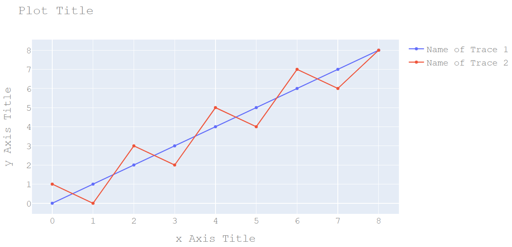

# Title

- [Title](#title)
  - [设置标题文本](#%e8%ae%be%e7%bd%ae%e6%a0%87%e9%a2%98%e6%96%87%e6%9c%ac)
  - [设置标题位置](#%e8%ae%be%e7%bd%ae%e6%a0%87%e9%a2%98%e4%bd%8d%e7%bd%ae)

## 设置标题文本

关于设置字体、标题、Legend 以及 Axis 标题。

```py
import plotly.graph_objects as go

fig = go.Figure()

fig.add_trace(go.Scatter(
    x=[0, 1, 2, 3, 4, 5, 6, 7, 8],
    y=[0, 1, 2, 3, 4, 5, 6, 7, 8],
    name="Name of Trace 1"       # 设置 Legend
))


fig.add_trace(go.Scatter(
    x=[0, 1, 2, 3, 4, 5, 6, 7, 8],
    y=[1, 0, 3, 2, 5, 4, 7, 6, 8],
    name="Name of Trace 2"
))

fig.update_layout(
    title="Plot Title", # 设置标题
    xaxis_title="x Axis Title",
    yaxis_title="y Axis Title",
    font=dict(
        family="Courier New, monospace",
        size=18,
        color="#7f7f7f"
    )
)

fig.show()
```



## 设置标题位置

设置选项

- `layout.title.x` 为相对 `ref` 的值，从 0 （左）到 1（右）
- `layout.title.y` 为相对 `ref` 的值，从0（底部）到 1（顶部）

另外还可以使用 `xanchor` {left, right, center} 设置标题相对位置 `x` 的对齐方式。

使用 `yanchor` {top, bottom, middle} 设置标题相对位置 `y` 的对齐方式。

例如：

```py
import plotly.graph_objects as go

fig = go.Figure(go.Scatter(
    y=[3, 1, 4],
    x=["Mon", "Tue", "Wed"]))

fig.update_layout(
    title={
        'text': "Plot Title",
        'y':0.9,
        'x':0.5,
        'xanchor': 'center',
        'yanchor': 'top'})

fig.show()
```

![title position](images/2020-03-14-11-25-42.png
