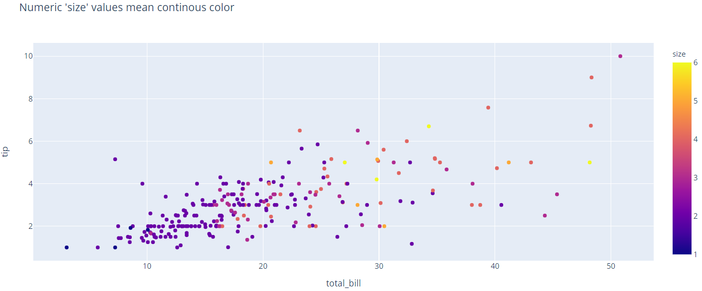

# Color

- [Color](#color)
  - [Continuous Color](#continuous-color)
  - [Discrete Colors](#discrete-colors)
    - [离散颜色概念](#%e7%a6%bb%e6%95%a3%e9%a2%9c%e8%89%b2%e6%a6%82%e5%bf%b5)
    - [Discrete Color with Express](#discrete-color-with-express)
    - [Color Sequences in Express](#color-sequences-in-express)
    - [创建颜色序列](#%e5%88%9b%e5%bb%ba%e9%a2%9c%e8%89%b2%e5%ba%8f%e5%88%97)

## Continuous Color

连续颜色涉及到如下几个概念：

- color scales

色标（color scales）表示 0 到 1 之间在某个颜色域的映射。

## Discrete Colors

离散颜色序列，也称为分类或定性色标。

### 离散颜色概念

- 颜色序列（color sequences）

颜色序列时映射到离散数据值的颜色列表。和连续色标（continuous color scale）不同，离散颜色序列的每种颜色按原样使用，不会出现插值的情况。

颜色序列的默认值取决于当前模板的 `layout.colorway` 属性，对许多 express 函数，可以通过 `color_discrete_sequence` 参数指定颜色序列。

- 图例（legend）

legends 是颜色和数据值之间的可视化映射。在多种 trances 的情况下，legend 标记的形状也会改变。在 `layout.legend` 属性中可以配置 legend。

### Discrete Color with Express

大多 Express 函数有一个 `color` 参数，对**非数值型数据**，该参数自动为其分配离散颜色。如果数据为数值型，会自动使用连续颜色分配颜色。

这表示，对字符串形式的数值，如果要使用连续颜色，需要将其转换为数值；相反，数值型数据如果要使用离散颜色，必须将其转换为字符串。

例如:

- `tips` 数据集中，`smoker` 为字符串

```py
import plotly.express as px

df = px.data.tips()
fig = px.scatter(df, x='total_bill', y="tip", color="smoker",
                 title="String 'smoker' values mean discrete colors")
fig.show()
```


- `size` 列包含数值

数值型数据，意味着连续颜色：[src](../src/plotly_test/color_numeric.py)

```py
import plotly.express as px

df = px.data.tips()
fig = px.scatter(df, x='total_bill', y='tip', color='size',
                 title="Numeric 'size' values mean continous color")
fig.show()
```



- 数值转换为字符串

将数值列转换为字符串很简单，但是需要注意，legend 中的顺序默认是无序的：[src](../src/plotly_test/color_num_str.py)

```py
import plotly.express as px

df = px.data.tips()
df['size'] = df['size'].astype(str)
fig = px.scatter(df, x='total_bill', y='tip', color='size',
                 title="String 'size' values mean discrete colors")
fig.show()
```


- 字符串转换为数值

将字符串数据转换为数值型也简单：

```py
import plotly.express as px

df = px.data.tips()
df['size'] = df['size'].astype(str)  # 转换为字符串
df['size'] = df['size'].astype(float)  # 重新转换为数值

fig = px.scatter(df, x='total_bill', y='tip', color='size',
                 title="Numeric 'size' values mean continous color")
fig.show()
```


### Color Sequences in Express

Express 默认使用当前 template 的 `layout.colorway` 属性指定的颜色序列，而默认的模板 `plotly` 使用 `plotly` 颜色序列。

可以从 `px.colors.qualitative` 模块中选择任意内置的离散颜色序列，也可以自定义颜色序列。

```py
import plotly.express as px

fig = px.colors.qualitative.swatches()
fig.show()
```


`px.colors.qualitative` 模块中的颜色序列以 CSS 颜色列表的形式保存，如 `plotly` 样式颜色：

```py
import plotly.express as px

print(px.colors.qualitative.Plotly)
```

```cmd
['#636EFA', '#EF553B', '#00CC96', '#AB63FA', '#FFA15A', '#19D3F3', '#FF6692', '#B6E880', '#FF97FF', '#FECB52']
```

下面以 `G10` 颜色序列创建一个散点图：

```py
import plotly.express as px

df = px.data.gapminder()
fig = px.line(df, y='lifeExp', x='year', color='continent', line_group='country', line_shape='spline',
              render_mode='svg', color_discrete_sequence=px.colors.qualitative.G10, title="Built-in G10 color sequence")
fig.show()
```


### 创建颜色序列

Express 的 
