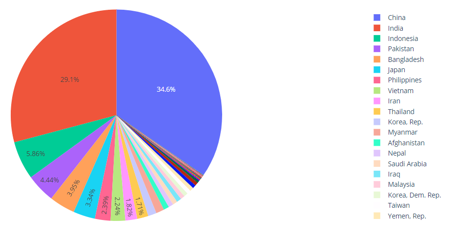

# Annotation

- [Annotation](#annotation)
  - [Text scatter plot with PX](#text-scatter-plot-with-px)
  - [Scatter 数据注释](#scatter-%e6%95%b0%e6%8d%ae%e6%b3%a8%e9%87%8a)
  - [设置字体大小 - uniformtext](#%e8%ae%be%e7%bd%ae%e5%ad%97%e4%bd%93%e5%a4%a7%e5%b0%8f---uniformtext)
  - [设置字体大小 - fontsize](#%e8%ae%be%e7%bd%ae%e5%ad%97%e4%bd%93%e5%a4%a7%e5%b0%8f---fontsize)
  - [参考](#%e5%8f%82%e8%80%83)

## Text scatter plot with PX

下面使用 Express 创建一个 散点图，并添加注释文本。

```py
import plotly.express as px

df = px.data.gapminder().query("year==2007 and continent=='Americas'")

fig = px.scatter(df, x="gdpPercap", y="lifeExp", text="country", log_x=True, size_max=60)

fig.update_traces(textposition='top center')

fig.update_layout(
    height=800,
    title_text='GDP and Life Expectancy (Americas, 2007)'
)

fig.show()
```


## Scatter 数据注释

```py
import plotly.graph_objects as go

fig = go.Figure()

fig.add_trace(go.Scatter(
    x=[0, 1, 2],
    y=[1, 1, 1],
    mode="lines+markers+text", # 线条+标记+文本
    name="Lines, Markers and Text", # Legend 名称
    text=["Text A", "Text B", "Text C"], # 设置注释文本
    textposition="top center" # 文本在数据点的正上方
))

fig.add_trace(go.Scatter(
    x=[0, 1, 2],
    y=[2, 2, 2],
    mode="markers+text",
    name="Markers and Text",
    text=["Text D", "Text E", "Text F"],
    textposition="bottom center"
))

fig.add_trace(go.Scatter(
    x=[0, 1, 2],
    y=[3, 3, 3],
    mode="lines+text",
    name="Lines and Text",
    text=["Text G", "Text H", "Text I"],
    textposition="bottom center"
))

fig.show()
```

`mode="lines+markers+text"` 表示同时显示 line, marker 和 text，对应下面的蓝线。


## 设置字体大小 - uniformtext

对 `pie`, `bar`, `sunburst`, `treemap` 等 traces，可以使用 `uniformtext` layout 参数设置所有文本标签相同的字体大小。

`minsize` 设置字体大小，`mode` 则在空间无法容下文本内容时的处理方式：隐藏（`hide`）或者溢出显示（`show`）。

```py
import plotly.express as px

df = px.data.gapminder().query("continent == 'Europe' and year == 2007 and pop > 2.e6")
fig = px.bar(df, y='pop', x='country', text='pop')
fig.update_traces(texttemplate='%{text:.2s}', textposition='outside')
fig.update_layout(uniformtext_minsize=8, uniformtext_mode='hide')
fig.show()
```


```py
import plotly.express as px

df = px.data.gapminder().query("continent == 'Asia' and year == 2007")
fig = px.pie(df, values='pop', names='country')
fig.update_traces(textposition='inside')
fig.update_layout(uniformtext_minsize=12, uniformtext_mode='hide')
fig.show()
```



## 设置字体大小 - fontsize

`pie`, `bar`, `sunburst` 和 `treemap` 等 traces 可以使用 `textfont_size` 设置最大字体大小。

```py
import plotly.express as px

df = px.data.gapminder().query("continent == 'Asia' and year == 2007")
fig = px.pie(df, values='pop', names='country')
fig.update_traces(textposition='inside', textfont_size=14)
fig.show()
```


## 参考

