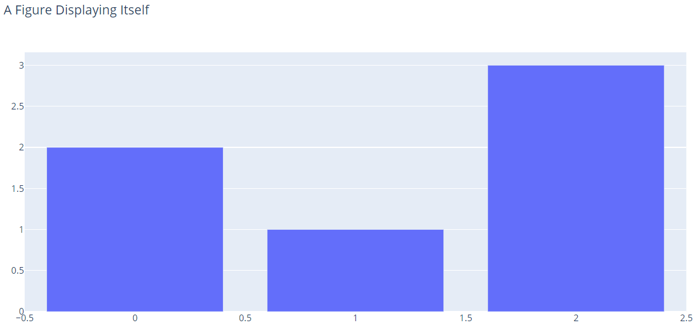

# 显示 plotly 绘图

- [显示 plotly 绘图](#%e6%98%be%e7%a4%ba-plotly-%e7%bb%98%e5%9b%be)
  - [简介](#%e7%ae%80%e4%bb%8b)
  - [渲染框架](#%e6%b8%b2%e6%9f%93%e6%a1%86%e6%9e%b6)
    - [设置默认渲染器](#%e8%ae%be%e7%bd%ae%e9%bb%98%e8%ae%a4%e6%b8%b2%e6%9f%93%e5%99%a8)
    - [覆盖默认渲染器](#%e8%a6%86%e7%9b%96%e9%bb%98%e8%ae%a4%e6%b8%b2%e6%9f%93%e5%99%a8)
  - [内置渲染器](#%e5%86%85%e7%bd%ae%e6%b8%b2%e6%9f%93%e5%99%a8)
    - [交互渲染器](#%e4%ba%a4%e4%ba%92%e6%b8%b2%e6%9f%93%e5%99%a8)
    - [notebook](#notebook)
    - [notebook_connected](#notebookconnected)
    - [kaggle 和 azure](#kaggle-%e5%92%8c-azure)
    - [colab](#colab)
    - [browser](#browser)
    - [firefox, chrome, chromium](#firefox-chrome-chromium)
    - [iframe 和 iframe_connected](#iframe-%e5%92%8c-iframeconnected)
    - [plotly_mimetype](#plotlymimetype)
    - [jupyterlab, nteract, vscode](#jupyterlab-nteract-vscode)
  - [静态图像渲染](#%e9%9d%99%e6%80%81%e5%9b%be%e5%83%8f%e6%b8%b2%e6%9f%93)
    - [png, jpeg, svg](#png-jpeg-svg)
    - [pdf](#pdf)
    - [json](#json)
  - [多渲染器](#%e5%a4%9a%e6%b8%b2%e6%9f%93%e5%99%a8)
  - [自定义内置渲染器](#%e8%87%aa%e5%ae%9a%e4%b9%89%e5%86%85%e7%bd%ae%e6%b8%b2%e6%9f%93%e5%99%a8)
  - [Dash](#dash)
  - [ipywidgets](#ipywidgets)

2020-04-19, 19:36
*** *

## 简介

plotly.py 支持多种图表显示方式。有三种通用方式：

- 使用脚本或 notebook 中的渲染框架
- 使用 web app 中的 Dash
- 使用 ipywidgets 中的 FigureWidget

下面分别讨论这三种方式。

## 渲染框架

渲染框架是一种在各种环境中显示图表的灵活方法。

调用 figure 的 `.show` 方法或将创建 figure 传递给 `plotly.io.show` 函数，在当前默认渲染框架中显示 figure。

```py
import plotly.graph_objects as go
fig = go.Figure(
    data=[go.Bar(y=[2, 1, 3])],
    layout_title_text="A Figure Displayed with fig.show()"
)
fig.show()
```


在大多情形，可以省略 `.show()` 调用，figure 会自动显示。

```py
import plotly.graph_objects as go
fig = go.Figure(
    data=[go.Bar(y=[2, 1, 3])],
    layout_title_text="A Figure Displaying Itself"
)
fig
```



> 准确地说，当满足以下两个条件图表会在当前默认渲染器中显示：
> 
> - 首先，最后一个表达式结果为 figure；
> - 然后，在包含 IPython kernel 的环境运行。

大多情况下，plotly 会自动选择合适的渲染器。如经典的 Jupyter Notebook，JupyterLab（需要安装 jupyterlab-plotly 扩展），Visual Studio code notebooks，Google Colaboratory, Kaggle notebooks，Azure notebooks 以及 Python interactive shell。

其它情况需要兼容的渲染器才行，包括 IPython console, QtConsole, Spyder等。

下面我们将说明如何配置默认的渲染器。之后会讨论所有的内置渲染器，以及如何选择。

### 设置默认渲染器

当前可用的渲染器和默认渲染器可以通过 `plotly.io.renderers` 配置。

查看当前默认渲染器及可用渲染器列表：

```py
import plotly.io as pio

print(pio.renderers)
```

本机输出：

```cmd
Default renderer: 'browser'
Available renderers:
    ['plotly_mimetype', 'jupyterlab', 'nteract', 'vscode',
        'notebook', 'notebook_connected', 'kaggle', 'azure', 'colab',
        'cocalc', 'databricks', 'json', 'png', 'jpeg', 'jpg', 'svg',
        'pdf', 'browser', 'firefox', 'chrome', 'chromium', 'iframe',
        'iframe_connected', 'sphinx_gallery']
```

不同配置 `pio.renderers` 的输出可能不同，因为 plotly.py 在启动时会自动检测合适的渲染器。

通过将可用渲染器名称赋值给 `pio.renderers.default` 属性设置默认渲染器。例如，切换到 'svg' 渲染器，即生成 svg 图像：

```py
import plotly.io as pio
pio.renderers.default = "svg"
```

也可以在系统环境变量设置默认的渲染器。因为 plotly.py 在启动时会检查 `PLOTLY_RENDERER` 环境变量，如果检查到该环境变量，且对应的渲染器是可用的，plotly.py 会将该渲染器作为默认值。

### 覆盖默认渲染器

通过将渲染器名称传递给 `.show()` 方法的 `renderer` 关键字，可以临时覆盖默认渲染器。例如，下面使用 `svg` 渲染器显示 figure，但不改变默认渲染器：

```py
import plotly.graph_objects as go

fig = go.Figure(
    data=[go.Bar(y=[2, 1, 3])],
    layout_title_text="A Figure Displayed with fig.show"
)

fig.show(renderer="svg")
```

## 内置渲染器

下面讨论内置渲染器，以及如何选择合适的渲染器。

### 交互渲染器

交互渲染器使用 Plotly.js JavaScript 库显示 figures，完全交互式，支持平移、缩放、悬停工具提示等。

### notebook

该渲染器用于经典的 Jupyter Notebook。在第一次渲染 figure 时，会将完整的 plotly.js JavaScript 库捆绑到 notebook 中，因此该渲染器可以不需要网络工作。

对于要导出为 HTML 文件的 notebook，包括用 `nbconvert` 或下载为 `Download as HTML` 菜单选项，使用该渲染器都是不错的选择，因为导出 HTML 文件无需联网。

> Note: 将 plotly.js 捆绑到 notebook 会使 notebook 增大几兆，如果你确定网络一直可用，可以采用 `notebook_connected` 渲染器。

### notebook_connected

除了在线从 CDN 加载 Plotly.js 库以外，该渲染器和 `notebook` 完全相同。

该渲染器的 notebook 比 `notebook` 渲染器小几兆，但是需要网络才能显示 figures。

该渲染器适合用 `nbviewer` 分享的 notebooks，因为这类 notebook 本来就必须联网才能查看。

### kaggle 和 azure

`notebook_connected` 的别名，因为该渲染器适合 Kaggle kernels 和 Azure notebooks。

### colab

用于 Google Colab 的自定义渲染器。

### browser

使用默认浏览器打开 figure。浏览器和 Python kernel 在同一个电脑才能使用，所以不适合 Jupyter Hub 或在线的 notebook 服务。

说明：

- 默认浏览器由 `webbrowser` Python 模块选择。
- `browser` 渲染器通过在本地端口上设置一次性的本地 Web 服务器工作，将图形发送给浏览器后，Web服务器关闭，因此刷新浏览器后无法恢复图形。

### firefox, chrome, chromium

和 `browser` 相同，但是强制使用特定浏览器。

### iframe 和 iframe_connected

这类渲染器将图形输出为独立的 HTML 文件，然后引用 HTML 文件的 `iframe` 元素。

`iframe` 渲染器在每个 HTML 文件中包含 Plotly.js JavaScript 包，`iframe_connected` 渲染器则包含 Plotly.js 在线 CDN 位置引用，和前面一样，`iframe_connected` 渲染输出的 HTML 文件要小于 `iframe`，但需要联网。

该渲染器对包含大量 figures 的 notebooks 比较有用。对 `notebook` 和 `notebook_connected`渲染器，所有 figures的数据都保存在 notebook 中，从而导致 notebook 较大，而在 `iframe` 渲染器中，figure 数据保存在单独的 HTML 文件中，所以 notebook 要小一些。

> iframe 渲染器生成的 HTML 文件保存在 `iframe_figures` 子目录。HTML 文件根据 notebook cell 执行顺序进行命名。所以每次重启 notebook kernel，前面的 HTML 文件被覆盖。这也表示在相同目录不能使用多个用 `iframe` 渲染器的 notebook，因此 notebook 生成的 figures 可能互相覆盖。

### plotly_mimetype

plotly_mimetype 渲染器创建一个plotly figure的规范（MIME-type bundle），并请求当前用户界面显示它。支持该渲染器的界面包括 JupyterLab，nteract和 Visual Studio Code notebook 界面。

### jupyterlab, nteract, vscode

`plotly_mimetype` 的别名。

## 静态图像渲染

plotly 提供了一组静态图像渲染器，都依赖于 orca 程序。

### png, jpeg, svg

将图像显示为静态 PNG, JPEG 或 SVG 图像。这类渲染器对不支持嵌入式 HTML 输出但支持嵌入式静态图像的用户界面很有用。包括 QtConsole, Spyder 和 PyCharm notebook 界面都是如此。

例如：

```py
import plotly.graph_objects as go
fig = go.Figure(
    data=[go.Bar(y=[2, 1, 3])],
    layout_title_text="A Figure Displayed with the 'png' Renderer"
)
fig.show(renderer="png")
```

### pdf

该渲染器将 figures 以静态 PDF 文件显示。这对于使用 nbconvert 的LaTeX 导出 PDF 的 notebook比较有用。

### json

在支持 json 的编辑器（JupyterLab, nteract 和 vscode等）中，该渲染器用可折叠的交互式树结构显然 figure 的 JSON 表示。这对于检查复杂图形结构很有用。

## 多渲染器

通过 `+` 可以指定多个渲染器。对于需要支持多种环境的 notebook 比较有用。例如，如果一个 notebook 指定默认渲染器为 `notebook+plotly_mimetype+pdf`，则该 notebook 在经典的 Jupyter Notebook, JupyterLab 以及导出 PDF 的 nbconvert 中均可用。

## 自定义内置渲染器

大部分内置渲染器可以自定义配置。通过 `plotly.io.renderers` 对象上使用字典查询访问渲染器的属性。例如，访问和显式 PNG 渲染器：

```py
import plotly.io as pio
png_renderer = pio.renderers["png"]
png_renderer
```

输出：

```cmd
PngRenderer(width=700, height=450, scale=None)

    Renderer to display figures as static PNG images.  This renderer requires
    the orca command-line utility and is broadly compatible across IPython
    environments (classic Jupyter Notebook, JupyterLab, QtConsole, VSCode,
    PyCharm, etc) and nbconvert targets (HTML, PDF, etc.).

    mime type: 'image/png'
```

从输出可以看出，`png` 渲染器支持3个属性，`width`, `height` 和 `scale`。通过设置其属性值实现自定义。

下面通过自定义 `png` 渲染器修改图像尺寸，将 `png` 设为默认渲染器，然后显式：

```py
import plotly.io as pio
png_renderer = pio.renderers["png"]
png_renderer.width = 500
png_renderer.height = 500

pio.renderers.default = "png"

import plotly.graph_objects as go
fig = go.Figure(
    data=[go.Bar(y=[2, 1, 3])],
    layout_title_text="A Figure Displayed with the 'png' Renderer"
)
fig.show()
```

也可以临时修改渲染器参数，将对应参数传递给 `.show()` 方法即可。例如：

```py
import plotly.graph_objects as go

fig = go.Figure(
    data=[go.Bar(y=[2, 1, 3])],
    layout_title_text="A Figure Displayed with the 'png' Renderer"
)
fig.show(renderer="png", width=800, height=300)
```

## Dash

Dash 是用于构建 web 应用的 Python 框架，它内置有显式 plotly figures 的功能。

不过 Dash 没有使用上面讨论的渲染框架，所用在 Dash 应用中不能使用 `.show` 和 `plotly.io.show` 方法显示。

## ipywidgets

使用 `plotly.graph_objects.FigureWidget` 对象可以在 ipywidgets 环境显示 plotly figures。

`FigureWidget` 是 graph 对象（和 `plotly.graph_objects.Figure` 一样），所以可以按照常规 `Figure` 一样添加 traces和更新。

另外 `FigureWidget` 也是 ipywidgets 对象，所以也可以和其它 ipywidgets 一起在 notebook 中构建界面。

需要注意的是 `FigureWidget` 也没有使用上面的渲染框架，所以也不能使用 `.show` 和 `plotly.io.show` 显示 `FigureWidget` 对象。
