# Plotly Express

- [Plotly Express](#plotly-express)
  - [简介](#%e7%ae%80%e4%bb%8b)
  - [A single import, with built-in datasets](#a-single-import-with-built-in-datasets)
  - [Scatter and Line plots](#scatter-and-line-plots)
  - [设置样式](#%e8%ae%be%e7%bd%ae%e6%a0%b7%e5%bc%8f)

## 简介

Plotly Express 是一个包装 `plotly.graph_objects` 的简洁高级API，以实现快速数据搜索和生成 figure。

每个 Plotly Express 函数都返回 `graph_objects.Figure` 对象，该对象的数据和布局根据提供的参数进行配置。

## A single import, with built-in datasets

下面导入 plotly.express，其中含有内置的数据集，如：

```py
import plotly.express as px

print(px.data.iris.__doc__)
print(px.data.iris().head())
```

输出为：

```cmd
Each row represents a flower.

https://en.wikipedia.org/wiki/Iris_flower_data_set

Returns:
    A `pandas.DataFrame` with 150 rows and the following columns:
    `['sepal_length', 'sepal_width', 'petal_length', 'petal_width', 'species', 'species_id']`.

   sepal_length  sepal_width  petal_length  petal_width species  species_id
0           5.1          3.5           1.4          0.2  setosa           1
1           4.9          3.0           1.4          0.2  setosa           1
2           4.7          3.2           1.3          0.2  setosa           1
3           4.6          3.1           1.5          0.2  setosa           1
4           5.0          3.6           1.4          0.2  setosa           1
```

## Scatter and Line plots

```py
import plotly.express as px

df = px.data.iris()
fig = px.scatter(df, x='sepal_width', y='sepal_length')
fig.show()
```

效果：

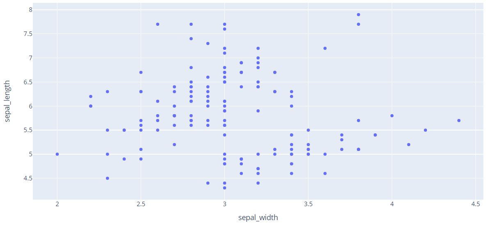

添加上颜色效果：

```py
import plotly.express as px
df = px.data.iris()
fig = px.scatter(df, x="sepal_width", y="sepal_length", color="species")
fig.show()
```

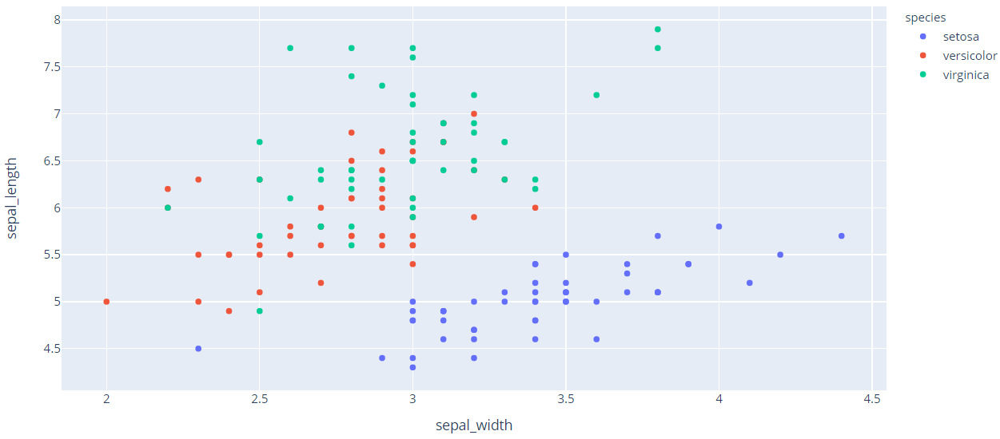

进一步添加统计图：

```py
import plotly.express as px
df = px.data.iris()
fig = px.scatter(df, x="sepal_width", y="sepal_length", color="species", marginal_y="rug", marginal_x="histogram")
fig
```

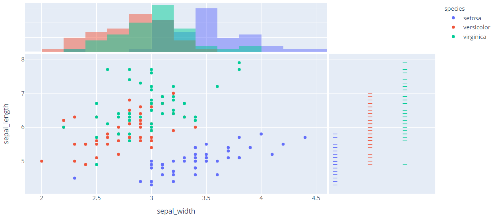

多种样式：

```py
import plotly.express as px
df = px.data.iris()
fig = px.scatter(df, x="sepal_width", y="sepal_length", color="species", marginal_y="violin",
           marginal_x="box", trendline="ols")
fig.show()
```

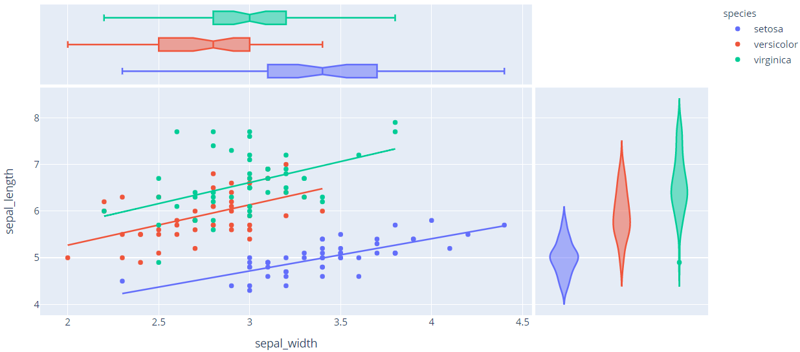

添加 error:

```py
import plotly.express as px
df = px.data.iris()
df["e"] = df["sepal_width"]/100
fig = px.scatter(df, x="sepal_width", y="sepal_length", color="species", error_x="e", error_y="e")
fig.show()
```


```py
import plotly.express as px
df = px.data.tips()
fig = px.scatter(df, x="total_bill", y="tip", facet_row="time", facet_col="day", color="smoker", trendline="ols",
          category_orders={"day": ["Thur", "Fri", "Sat", "Sun"], "time": ["Lunch", "Dinner"]})
fig.show()
```

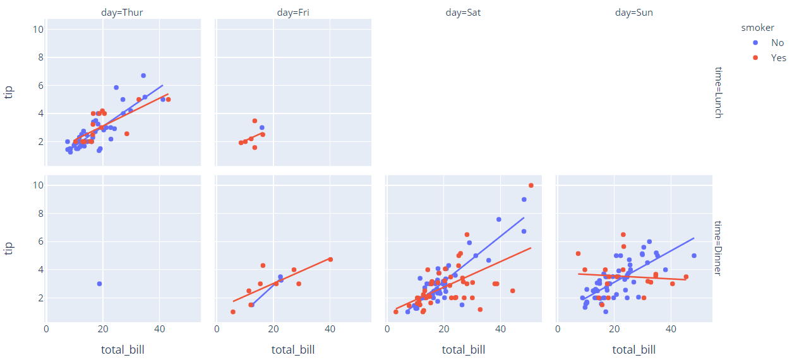

```py
import plotly.express as px
df = px.data.iris()
fig = px.scatter_matrix(df)
fig.show()
```

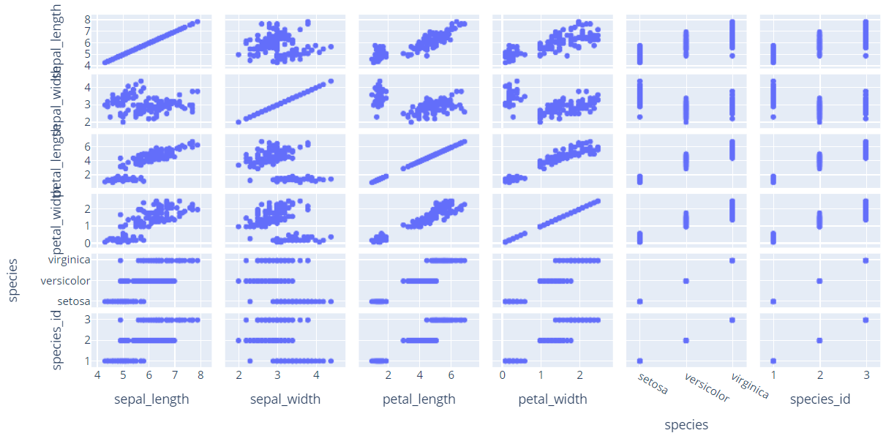

```py
import plotly.express as px
df = px.data.iris()
fig = px.scatter_matrix(df, dimensions=["sepal_width", "sepal_length", "petal_width", "petal_length"], color="species")
fig.show()
```

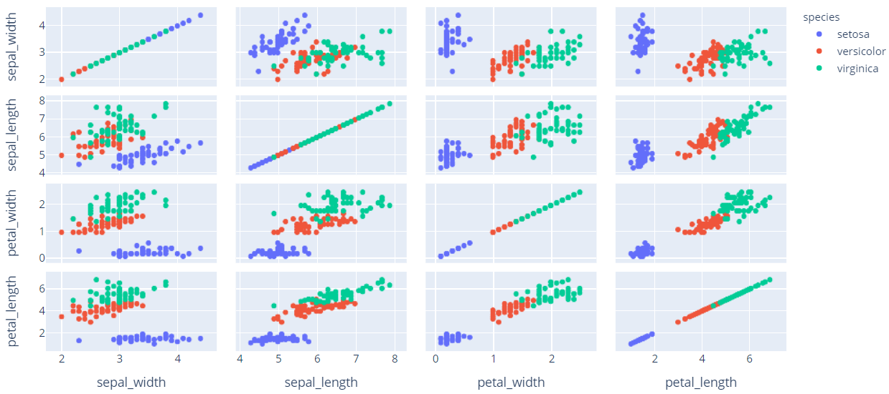

```py
import plotly.express as px
df = px.data.iris()
fig = px.parallel_coordinates(df, color="species_id", labels={"species_id": "Species",
                  "sepal_width": "Sepal Width", "sepal_length": "Sepal Length",
                  "petal_width": "Petal Width", "petal_length": "Petal Length", },
                    color_continuous_scale=px.colors.diverging.Tealrose, color_continuous_midpoint=2)
fig.show()
```


```py
import plotly.express as px
df = px.data.tips()
fig = px.parallel_categories(df, color="size", color_continuous_scale=px.colors.sequential.Inferno)
fig.show()
```

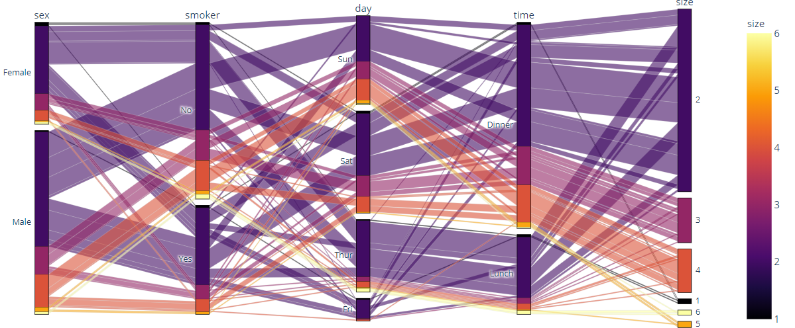

```py
import plotly.express as px
df = px.data.tips()
fig = px.scatter(df, x="total_bill", y="tip", color="size", facet_col="sex",
           color_continuous_scale=px.colors.sequential.Viridis, render_mode="webgl")
fig.show()
```

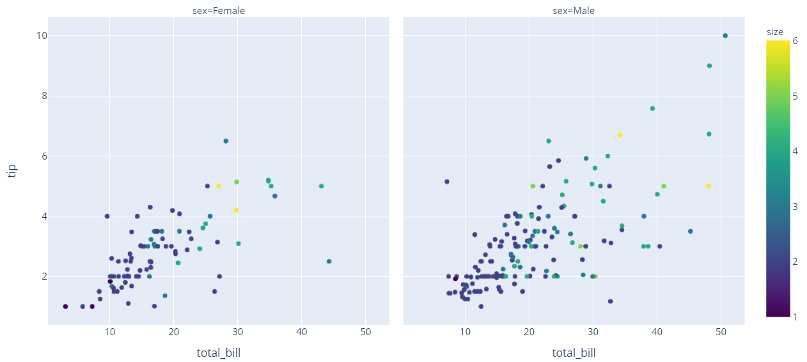

```py
import plotly.express as px
df = px.data.gapminder()
fig = px.scatter(df.query("year==2007"), x="gdpPercap", y="lifeExp", size="pop", color="continent",
           hover_name="country", log_x=True, size_max=60)
fig.show()
```


```py
import plotly.express as px
df = px.data.gapminder()
fig = px.scatter(df, x="gdpPercap", y="lifeExp", animation_frame="year", animation_group="country",
           size="pop", color="continent", hover_name="country", facet_col="continent",
           log_x=True, size_max=45, range_x=[100,100000], range_y=[25,90])
fig.show()
```

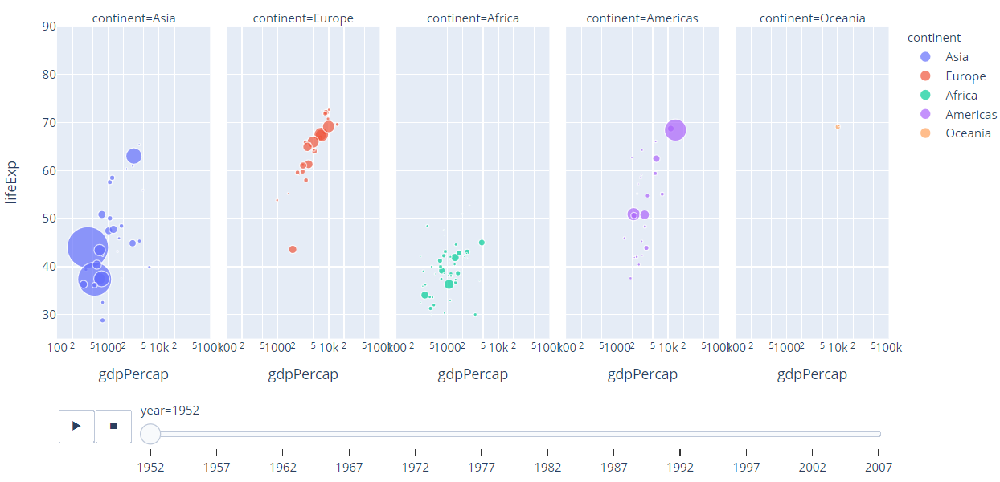

```py
import plotly.express as px
df = px.data.gapminder()
fig = px.line(df, x="year", y="lifeExp", color="continent", line_group="country", hover_name="country",
        line_shape="spline", render_mode="svg")
fig.show()
```

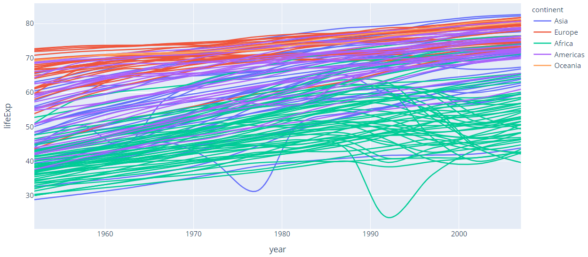

```py
import plotly.express as px
df = px.data.gapminder()
fig = px.area(df, x="year", y="pop", color="continent", line_group="country")
fig.show()
```


## 设置样式
