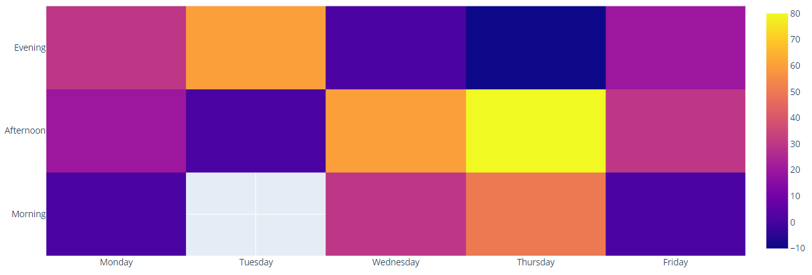
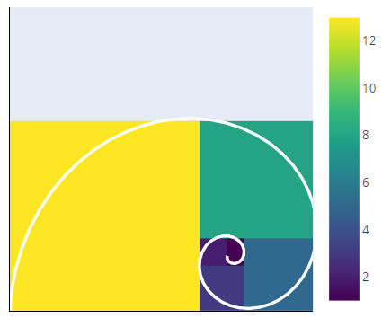

# Heatmap

- [Heatmap](#heatmap)
  - [简介](#%e7%ae%80%e4%bb%8b)
  - [heatmap with px](#heatmap-with-px)
    - [axes 和标签设置](#axes-%e5%92%8c%e6%a0%87%e7%ad%be%e8%ae%be%e7%bd%ae)
  - [heatmap with go](#heatmap-with-go)
    - [Categorical Axis](#categorical-axis)
    - [Unequal block size](#unequal-block-size)
    - [heatmap with datetime axis](#heatmap-with-datetime-axis)
  - [参考](#%e5%8f%82%e8%80%83)
    - [heatmap 属性](#heatmap-%e5%b1%9e%e6%80%a7)
      - [`z`](#z)
      - [`x`, `y`](#x-y)
      - [`hoverongaps`](#hoverongaps)

2020-04-30, 16:14
*** *

## 简介

热图中值到颜色的映射数据通过 `z` 设置。`z` 数据为 2D 或 1D 列表。

对 2D 列表，假设 `z` 为 N 行 M 列，则热图在 y 轴有 N 个分区，在 x 轴有 M 个分区。换句话说，`z` 的第 i 行第 j 列对应 y 轴的 i (从下到上) x 轴的 j (从左到右)。

另外，`x` 可以提供 M 或 M + 1 个值：

- 如果提供 M 个值，则和热图 Cell 的中心对应，所有 Cell 具有相同宽度；
- 如果提供 M + 1 个值，则和热图 cell 的边对应。

## heatmap with px

使用 `px.imshow`，输入数组的每个值由一个 heatmap pixel 表示。

例如：

```py
import plotly.express as px

fig = px.imshow([[1, 20, 30],
                 [20, 1, 60],
                 [30, 60, 1]])
fig.show()
```


### axes 和标签设置

使用 `x`, `y` 和 `labels` 参数设置 heatmap 相关参数。使用 `.update_xaxes()` 设置 x 轴标签位置。

```py
import plotly.express as px
data=[[1, 25, 30, 50, 1], [20, 1, 60, 80, 30], [30, 60, 1, 5, 20]]
fig = px.imshow(data,
                labels=dict(x="Day of Week", y="Time of Day", color="Productivity"),
                x=['Monday', 'Tuesday', 'Wednesday', 'Thursday', 'Friday'],
                y=['Morning', 'Afternoon', 'Evening']
               )
fig.update_xaxes(side="top")
fig.show()
```


## heatmap with go

```py
import plotly.graph_objects as go

fig = go.Figure(data=go.Heatmap(
                    z=[[1, 20, 30],
                      [20, 1, 60],
                      [30, 60, 1]]))
fig.show()
```


### Categorical Axis

```py
import plotly.graph_objects as go

fig = go.Figure(go.Heatmap(
    z=[[1, None, 30, 50, 1], [20, 1, 60, 80, 30], [30, 60, 1, -10, 20]],
    x=['Monday', 'Tuesday', 'Wednesday', 'Thursday', 'Friday'],
    y=['Morning', 'Afternoon', 'Evening'],
    hoverongaps=False
))
fig.show()
```

`hoverongaps=False` 表示对缺失值，不显示任何 hover 信息。



### Unequal block size

```py
import numpy as np
import plotly.graph_objects as go

phi = (1 + np.sqrt(5)) / 2.  # golden ratio
xe = [0, 1, 1 + (1 / (phi ** 4)), 1 + (1 / (phi ** 3)), phi]
ye = [0, 1 / (phi ** 3), 1 / phi ** 3 + 1 / phi ** 4, 1 / (phi ** 2), 1]

# x, y 有五个值，均比 z 多一个，对应 cell 两边，所以大小不一致
z = [[13, 3, 3, 5],
     [13, 2, 1, 5],
     [13, 10, 11, 12],
     [13, 8, 8, 8]]

fig = go.Figure(data=go.Heatmap(
    x=np.sort(xe),
    y=np.sort(ye),
    z=z,
    colorscale='Viridis'
))


# 添加样条线
def spiral(th):
    a = 1.120529
    b = 0.306349
    r = a * np.exp(-b * th)
    return r * np.cos(th), r * np.sin(th)


theta = np.linspace(-np.pi / 13, 4 * np.pi, 1000)  # angle
(x, y) = spiral(theta)

fig.add_trace(go.Scatter(x=-x + x[0], y=y - y[0],
                         line=dict(color='white', width=3)))

axis_template = dict(range=[0, 1.6], autorange=False,
                     showgrid=False, zeroline=False,
                     linecolor='black', showticklabels=False,
                     ticks='')

fig.update_layout(margin=dict(t=200, r=200, b=200, l=200),
                  xaxis=axis_template,
                  yaxis=axis_template,
                  showlegend=False,
                  width=700, height=700,
                  autosize=False)

fig.show()
```



### heatmap with datetime axis

```py
import plotly.graph_objects as go
import datetime
import numpy as np
np.random.seed(1)

programmers = ['Alex','Nicole','Sara','Etienne','Chelsea','Jody','Marianne']

base = datetime.datetime.today()
dates = base - np.arange(180) * datetime.timedelta(days=1)
z = np.random.poisson(size=(len(programmers), len(dates)))

fig = go.Figure(data=go.Heatmap(
        z=z,
        x=dates,
        y=programmers,
        colorscale='Viridis'))

fig.update_layout(
    title='GitHub commits per day',
    xaxis_nticks=36)

fig.show()
```


## 参考

### heatmap 属性

#### `z`

list, numpy array, Pandas series of number, strings, or datetimes.

设置 z 数据。

#### `x`, `y`

x, y 坐标值。

#### `hoverongaps`

boolean, 默认 True。

`z` 数据中的 gaps (缺失值或 nan) 是否具有与之关联的 hover 标签。

如果 `hoverongaps=True`，则哪怕是缺失值，在热图中是空的，鼠标放在上面也会有悬停信息显示。

如果 `hoverongaps=False`，鼠标放在缺失块无信息显示。
