# Pie Chart

- [Pie Chart](#pie-chart)
  - [Pie chart with px](#pie-chart-with-px)
    - [重复值](#%e9%87%8d%e5%a4%8d%e5%80%bc)
    - [设置扇区颜色 - sequence](#%e8%ae%be%e7%bd%ae%e6%89%87%e5%8c%ba%e9%a2%9c%e8%89%b2---sequence)
    - [设置扇区颜色 - map](#%e8%ae%be%e7%bd%ae%e6%89%87%e5%8c%ba%e9%a2%9c%e8%89%b2---map)
    - [自定义设置 px](#%e8%87%aa%e5%ae%9a%e4%b9%89%e8%ae%be%e7%bd%ae-px)
  - [go.Pie](#gopie)
  - [颜色设置](#%e9%a2%9c%e8%89%b2%e8%ae%be%e7%bd%ae)
  - [字体大小 - uniformtext](#%e5%ad%97%e4%bd%93%e5%a4%a7%e5%b0%8f---uniformtext)
  - [标签方向](#%e6%a0%87%e7%ad%be%e6%96%b9%e5%90%91)
  - [面窝型（Donut Chart）](#%e9%9d%a2%e7%aa%9d%e5%9e%8bdonut-chart)
  - [分离扇区](#%e5%88%86%e7%a6%bb%e6%89%87%e5%8c%ba)
  - [多个 pie](#%e5%a4%9a%e4%b8%aa-pie)
  - [面积和数值成比例](#%e9%9d%a2%e7%a7%af%e5%92%8c%e6%95%b0%e5%80%bc%e6%88%90%e6%af%94%e4%be%8b)
  - [参考](#%e5%8f%82%e8%80%83)
    - [textfont](#textfont)

2020-04-24, 20:10
*** *

## Pie chart with px

使用 `px.pie` 绘制饼图，通过 `values` 参数指定扇区数据，通过 `names` 指定不同扇区的标签。

```py
import plotly.express as px

df = px.data.gapminder().query("year == 2007").query("continent == 'Europe'")
df.loc[df['pop'] < 2.e6, 'country'] = 'Other countries'
fig = px.pie(df, values='pop', names='country', title='Population of European continent')
fig.show()
```

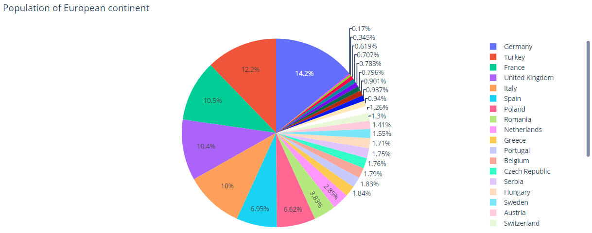

### 重复值

对 `names` 中的重复值，会归类到同一个扇区。

```py
import plotly.express as px
# This dataframe has 244 lines, but 4 distinct values for `day`
df = px.data.tips()
fig = px.pie(df, values='tip', names='day')
fig.show()
```

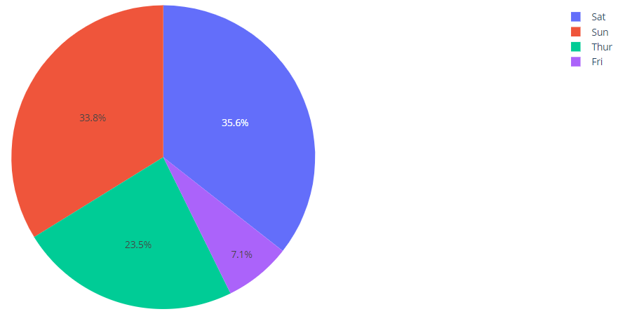

### 设置扇区颜色 - sequence

```py
import plotly.express as px
df = px.data.tips()
fig = px.pie(df, values='tip', names='day', color_discrete_sequence=px.colors.sequential.RdBu)
fig.show()
```

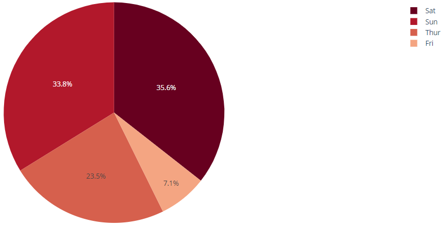

### 设置扇区颜色 - map

```py
import plotly.express as px
df = px.data.tips()
fig = px.pie(df, values='tip', names='day', color='day',
             color_discrete_map={'Thur':'lightcyan',
                                 'Fri':'cyan',
                                 'Sat':'royalblue',
                                 'Sun':'darkblue'})
fig.show()
```

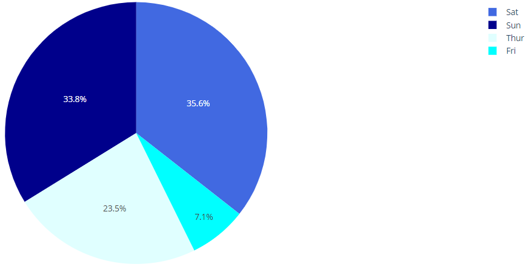

### 自定义设置 px

通过 `hover_data` 设置鼠标悬浮信息，使用 `labels` 命名 columns。

```py
import plotly.express as px
df = px.data.gapminder().query("year == 2007").query("continent == 'Americas'")
fig = px.pie(df, values='pop', names='country',
             title='Population of American continent',
             hover_data=['lifeExp'], labels={'lifeExp':'life expectancy'})
fig.update_traces(textposition='inside', textinfo='percent+label')
fig.show()
```


## go.Pie

`go.Pie` 绘制饼图，`values` 参数对应扇区大小，`labels` 对应扇区标签，`marker_colors` 对应扇区颜色。

```py
import plotly.graph_objects as go

labels = ['Oxygen','Hydrogen','Carbon_Dioxide','Nitrogen']
values = [4500, 2500, 1053, 500]

fig = go.Figure(data=[go.Pie(labels=labels, values=values)])
fig.show()
```


## 颜色设置

可以使用 RGB, hex 或 CSS 颜色名称设置颜色。

```py
import plotly.graph_objects as go
colors = ['gold', 'mediumturquoise', 'darkorange', 'lightgreen']

fig = go.Figure(data=[go.Pie(labels=['Oxygen','Hydrogen','Carbon_Dioxide','Nitrogen'],
                             values=[4500,2500,1053,500])])
fig.update_traces(hoverinfo='label+percent', textinfo='value', textfont_size=20,
                  marker=dict(colors=colors, line=dict(color='#000000', width=2)))
fig.show()
```

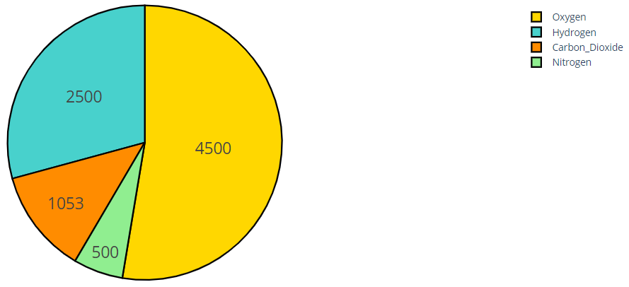

## 字体大小 - uniformtext

如果你需要所有标签字体大小相同，可以使用 [`uniformtext`](ref_layout.md#uniformtext)。

例如：

```py
import plotly.express as px

df = px.data.gapminder().query("continent == 'Asia'")
fig = px.pie(df, values='pop', names='country')
fig.update_traces(textposition='inside')
fig.update_layout(uniformtext_minsize=12, uniformtext_mode='hide')
fig.show()
```

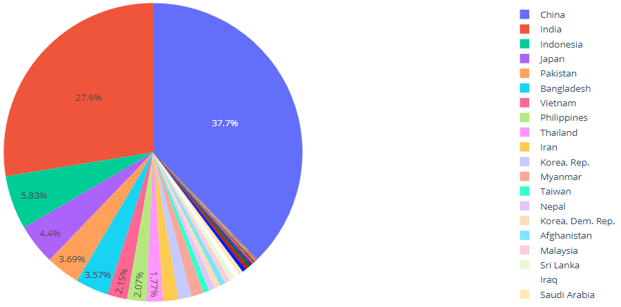

## 标签方向

`insidetextorientation` 用于设置标签文本的方向：

- `auto` 文本自动根据扇区旋转文本
- `horizontal` 文本水平
- `radial` 文本放射状
- `tanential` 切线

例如，下面用 px 创建 pie，使用 `fig.update_traces(insidetextorientation='...')` 设置文本方向：

```py
import plotly.graph_objects as go

labels = ['Oxygen','Hydrogen','Carbon_Dioxide','Nitrogen']
values = [4500, 2500, 1053, 500]

fig = go.Figure(data=[go.Pie(labels=labels, values=values, textinfo='label+percent',
                             insidetextorientation='radial'
                            )])
fig.show()
```

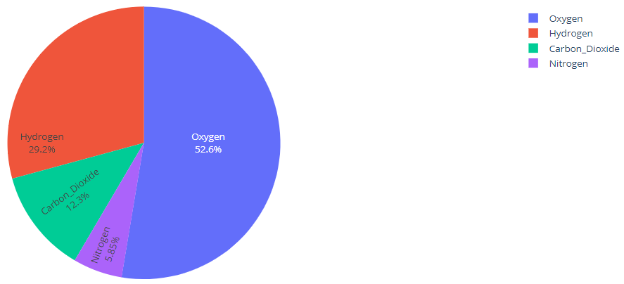

## 面窝型（Donut Chart）

```py
import plotly.graph_objects as go

labels = ['Oxygen','Hydrogen','Carbon_Dioxide','Nitrogen']
values = [4500, 2500, 1053, 500]

# Use `hole` to create a donut-like pie chart
fig = go.Figure(data=[go.Pie(labels=labels, values=values, hole=.3)])
fig.show()
```

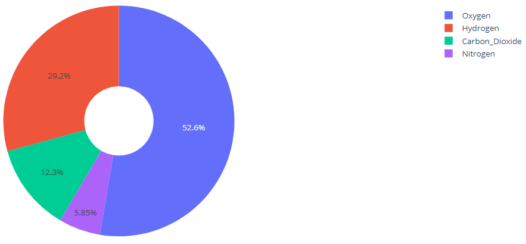

## 分离扇区

使用 `pull` 参数将某个扇区分离出来。可以是一个标量，拉出所有扇区，也可以是一个数组，拉出部分扇区。例如：

```py
import plotly.graph_objects as go

labels = ['Oxygen','Hydrogen','Carbon_Dioxide','Nitrogen']
values = [4500, 2500, 1053, 500]

# pull is given as a fraction of the pie radius
fig = go.Figure(data=[go.Pie(labels=labels, values=values, pull=[0, 0, 0.2, 0])])
fig.show()
```

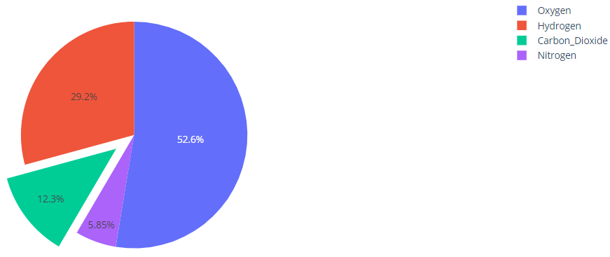

## 多个 pie

```py
import plotly.graph_objects as go
from plotly.subplots import make_subplots

labels = ["US", "China", "European Union", "Russian Federation", "Brazil", "India",
          "Rest of World"]

# Create subplots: use 'domain' type for Pie subplot
fig = make_subplots(rows=1, cols=2, specs=[[{'type':'domain'}, {'type':'domain'}]])
fig.add_trace(go.Pie(labels=labels, values=[16, 15, 12, 6, 5, 4, 42], name="GHG Emissions"),
              1, 1)
fig.add_trace(go.Pie(labels=labels, values=[27, 11, 25, 8, 1, 3, 25], name="CO2 Emissions"),
              1, 2)

# Use `hole` to create a donut-like pie chart
fig.update_traces(hole=.4, hoverinfo="label+percent+name")

fig.update_layout(
    title_text="Global Emissions 1990-2011",
    # Add annotations in the center of the donut pies.
    annotations=[dict(text='GHG', x=0.18, y=0.5, font_size=20, showarrow=False),
                 dict(text='CO2', x=0.82, y=0.5, font_size=20, showarrow=False)])
fig.show()
```

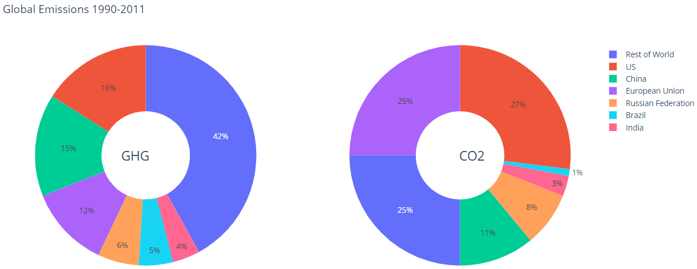

```py
import plotly.graph_objects as go
from plotly.subplots import make_subplots

labels = ['1st', '2nd', '3rd', '4th', '5th']

# Define color sets of paintings
night_colors = ['rgb(56, 75, 126)', 'rgb(18, 36, 37)', 'rgb(34, 53, 101)',
                'rgb(36, 55, 57)', 'rgb(6, 4, 4)']
sunflowers_colors = ['rgb(177, 127, 38)', 'rgb(205, 152, 36)', 'rgb(99, 79, 37)',
                     'rgb(129, 180, 179)', 'rgb(124, 103, 37)']
irises_colors = ['rgb(33, 75, 99)', 'rgb(79, 129, 102)', 'rgb(151, 179, 100)',
                 'rgb(175, 49, 35)', 'rgb(36, 73, 147)']
cafe_colors =  ['rgb(146, 123, 21)', 'rgb(177, 180, 34)', 'rgb(206, 206, 40)',
                'rgb(175, 51, 21)', 'rgb(35, 36, 21)']

# Create subplots, using 'domain' type for pie charts
specs = [[{'type':'domain'}, {'type':'domain'}], [{'type':'domain'}, {'type':'domain'}]]
fig = make_subplots(rows=2, cols=2, specs=specs)

# Define pie charts
fig.add_trace(go.Pie(labels=labels, values=[38, 27, 18, 10, 7], name='Starry Night',
                     marker_colors=night_colors), 1, 1)
fig.add_trace(go.Pie(labels=labels, values=[28, 26, 21, 15, 10], name='Sunflowers',
                     marker_colors=sunflowers_colors), 1, 2)
fig.add_trace(go.Pie(labels=labels, values=[38, 19, 16, 14, 13], name='Irises',
                     marker_colors=irises_colors), 2, 1)
fig.add_trace(go.Pie(labels=labels, values=[31, 24, 19, 18, 8], name='The Night Café',
                     marker_colors=cafe_colors), 2, 2)

# Tune layout and hover info
fig.update_traces(hoverinfo='label+percent+name', textinfo='none')
fig.update(layout_title_text='Van Gogh: 5 Most Prominent Colors Shown Proportionally',
           layout_showlegend=False)

fig = go.Figure(fig)
fig.show()
```


## 面积和数值成比例

在同一个 `scalegroup` 中的 plots，面积和总的数目一致。

```py
import plotly.graph_objects as go
from plotly.subplots import make_subplots

labels = ["Asia", "Europe", "Africa", "Americas", "Oceania"]

fig = make_subplots(1, 2, specs=[[{'type':'domain'}, {'type':'domain'}]],
                    subplot_titles=['1980', '2007'])
fig.add_trace(go.Pie(labels=labels, values=[4, 7, 1, 7, 0.5], scalegroup='one',
                     name="World GDP 1980"), 1, 1)
fig.add_trace(go.Pie(labels=labels, values=[21, 15, 3, 19, 1], scalegroup='one',
                     name="World GDP 2007"), 1, 2)

fig.update_layout(title_text='World GDP')
fig.show()
```

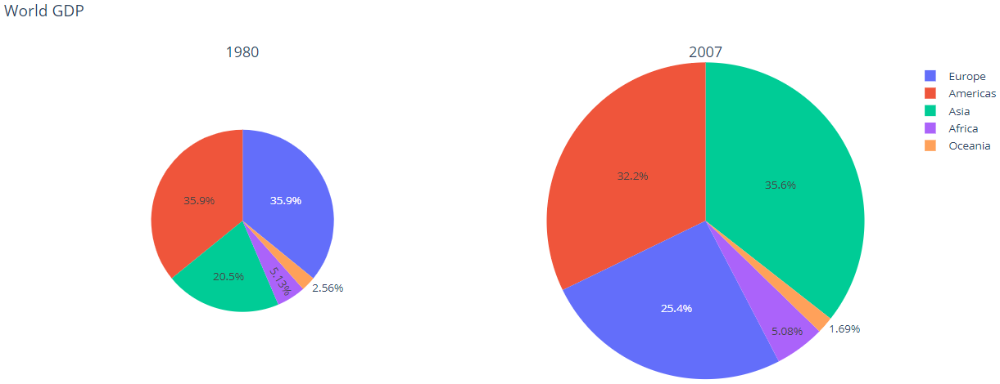

## 参考

### textfont

`data[type=pie]`

设置 `textinfo` 的字体。

- family

Type: string or array of strins.

HTML font family，应用到浏览器的字体。只有当系统包含对应字体时，设置才有用。

如果提供多个字体，以逗号分隔，plotly 会依次应用字体，直到找到有效字体。

plotly 支持的字体有 "Arial", "Balto", "Courier New", "Droid Sans", "Droid Serif", "Droid Sans Mono", "Gratitas One", "Old Standard TT", "Open Sans", "Overpass", "PT Sans Narrow", "Raleway", "Times New Roman".

- size

Type: >=1 的数或数组。

字体大小。

- color

Type: color 或 color 数组。

字体颜色。
