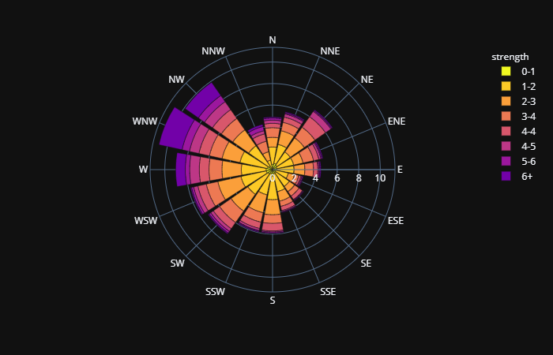
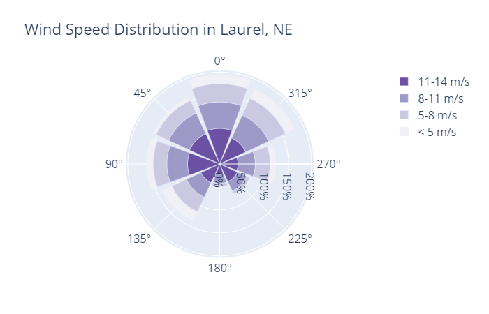

# Polar Bar Chart

- [Polar Bar Chart](#polar-bar-chart)
  - [简介](#%e7%ae%80%e4%bb%8b)
  - [Bar Polar with px](#bar-polar-with-px)
  - [Bar Polar with go](#bar-polar-with-go)
  - [References](#references)
    - [name](#name)
    - [`r`](#r)

2020-05-15, 14:03
***

## 简介

风向图（window rose chart），又称为极坐标条形图（Polar Bar Chart），用于可视化风速、风向。

可以使用 `px.bar_polar` 和 `go.Barpolar` 绘制。

## Bar Polar with px

```py
import plotly.express as px

df = px.data.wind()  # 三维数据，风向，强度，频率

# 频率对应半径，角度对应风向，颜色对应强度
fig = px.bar_polar(df, r='frequency', theta='direction', color='strength',
                   template='plotly_dark', color_discrete_sequence=px.colors.sequential.Plasma_r)
fig.show()
```



## Bar Polar with go

```py
import plotly.graph_objects as go

fig = go.Figure()
fig.add_trace(go.Barpolar(
    r=[77.5, 72.5, 70.0, 45.0, 22.5, 42.5, 40.0, 62.5],
    name='11-14 m/s',
    marker_color='rgb(106,81,163)'
))
fig.add_trace(go.Barpolar(
    r=[57.5, 50.0, 45.0, 35.0, 20.0, 22.5, 37.5, 55.0],
    name='8-11 m/s',
    marker_color='rgb(158,154,200)'
))
fig.add_trace(go.Barpolar(
    r=[40.0, 30.0, 30.0, 35.0, 7.5, 7.5, 32.5, 40.0],
    name='5-8 m/s',
    marker_color='rgb(203,201,226)'
))
fig.add_trace(go.Barpolar(
    r=[20.0, 7.5, 15.0, 22.5, 2.5, 2.5, 12.5, 22.5],
    name='< 5 m/s',
    marker_color='rgb(242,240,247)'
))

fig.update_traces(text=['North', 'N-E', 'East', 'S-E', 'South', 'S-W', 'West', 'N-W'])
fig.update_layout(
    title='Wind Speed Distribution in Laurel, NE',
    font_size=16,
    legend_font_size=16,
    polar_radialaxis_ticksuffix='%',
    polar_angularaxis_rotation=90,

)
fig.show()
```

每个 `Barpolar` 对应一圈柱状图，它们互相堆叠，构成下图的效果。



## References

`Barpolar` 的数据通过 `r` 设置。

### name


### `r`

径向值，离中心越远，该值越大。
