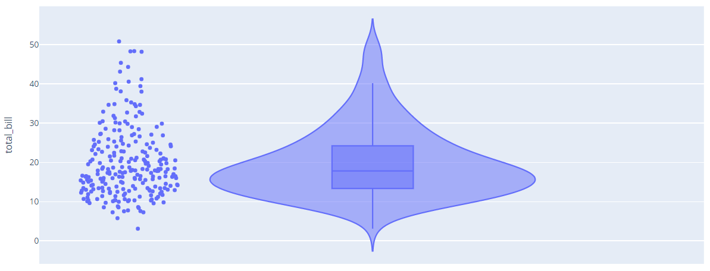
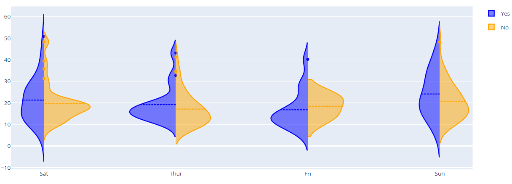
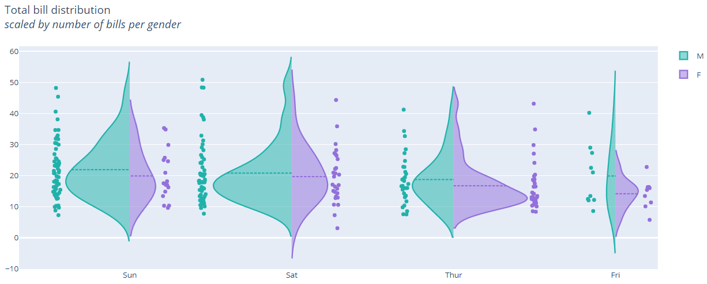

# Violin Plots

- [Violin Plots](#violin-plots)
  - [Violin with px](#violin-with-px)
    - [基本 violin](#%e5%9f%ba%e6%9c%ac-violin)
    - [加入 box 和数据点](#%e5%8a%a0%e5%85%a5-box-%e5%92%8c%e6%95%b0%e6%8d%ae%e7%82%b9)
    - [多个 violin](#%e5%a4%9a%e4%b8%aa-violin)
  - [go.violin](#goviolin)
    - [基本 Violin](#%e5%9f%ba%e6%9c%ac-violin-1)
    - [多个小提琴](#%e5%a4%9a%e4%b8%aa%e5%b0%8f%e6%8f%90%e7%90%b4)
    - [分组 violin](#%e5%88%86%e7%bb%84-violin)
    - [不对称 violin](#%e4%b8%8d%e5%af%b9%e7%a7%b0-violin)
    - [高级 violin](#%e9%ab%98%e7%ba%a7-violin)
    - [Ridgeline plot](#ridgeline-plot)
  - [参考](#%e5%8f%82%e8%80%83)
    - [基本属性](#%e5%9f%ba%e6%9c%ac%e5%b1%9e%e6%80%a7)
      - [`name`](#name)
      - [`x`, `y`](#x-y)
      - [`legendgroup`](#legendgroup)
      - [`scalegroup`](#scalegroup)
      - [`scalemode`](#scalemode)
    - [`data[type=violin].line`](#datatypeviolinline)
    - [箱线图设置](#%e7%ae%b1%e7%ba%bf%e5%9b%be%e8%ae%be%e7%bd%ae)
    - [均值线](#%e5%9d%87%e5%80%bc%e7%ba%bf)
    - [颜色](#%e9%a2%9c%e8%89%b2)
      - [`data[type=violin].fillcolor`](#datatypeviolinfillcolor)
      - [`data[type=violin].opacity`](#datatypeviolinopacity)
    - [`layout` 属性](#layout-%e5%b1%9e%e6%80%a7)
      - [`layout.violinmode`](#layoutviolinmode)

2020-04-16, 15:46
*** *

## Violin with px

`plotly.express.violin(data_frame=None, x=None, y=None, color=None, facet_row=None, facet_col=None, facet_col_wrap=0, hover_name=None, hover_data=None, custom_data=None, animation_frame=None, animation_group=None, category_orders={}, labels={}, color_discrete_sequence=None, color_discrete_map={}, orientation='v', violinmode='group', log_x=False, log_y=False, range_x=None, range_y=None, points=None, box=False, title=None, template=None, width=None, height=None)`

1. data_frame

提供数据。

2. x

data_frame 中列的名称，或 pandas Series，或 array_link 对象。

3. y

data_frame 中列的名称，或 pandas Series，或 array_link 对象。该参数值用于确定数据点在 y 轴的位置。

4. color

`data_frame` 中列的名称（str or int），或者 pandas `Series` 或 array-like 对象。

设置颜色。

5. box

boolean, default False。

True 表示在 violins 中绘制 boxes。

6. points
  
`outliers`, `suspectedoutliers`, `all`, 或 `False`。默认 `outliers`。

- `outliers`, 只绘制盒须框外的数据点；
- `suspectedoutliers`, 显示所有的离阈点，对小于 4Q1-3Q3 或大于 4Q3-3Q1 的数据点用 marker 的 `outliercolor` 高亮；
- `all`, 显示所有的数据点点；
- `False`, 不显式样本点，盒须图延展到整个区域。

7. violinmode

(str, default 'group')

- `group`, violins 并排绘制.
- `overlay`, violins 重叠绘制，第二个在第一个上面绘制。

hover_data, (list of str or int, or Series or array_link), data_frame 中 columns 名称 ，或 pandas Series 或 array_link 对象，用作额外的悬停提示数据。

### 基本 violin

```py
import plotly.express as px

df = px.data.tips()
fig = px.violin(df, y="total_bill")
fig.show()
```

数据如下：

```text
     total_bill   tip     sex smoker   day    time  size
0         16.99  1.01  Female     No   Sun  Dinner     2
1         10.34  1.66    Male     No   Sun  Dinner     3
2         21.01  3.50    Male     No   Sun  Dinner     3
3         23.68  3.31    Male     No   Sun  Dinner     2
4         24.59  3.61  Female     No   Sun  Dinner     4
..          ...   ...     ...    ...   ...     ...   ...
239       29.03  5.92    Male     No   Sat  Dinner     3
240       27.18  2.00  Female    Yes   Sat  Dinner     2
241       22.67  2.00    Male    Yes   Sat  Dinner     2
242       17.82  1.75    Male     No   Sat  Dinner     2
243       18.78  3.00  Female     No  Thur  Dinner     2

[244 rows x 7 columns]
```


### 加入 box 和数据点

```py
import plotly.express as px

df = px.data.tips()
fig = px.violin(df, y="total_bill", box=True, # draw box plot inside the violin
                points='all', # can be 'outliers', or False
               )
fig.show()
```



### 多个 violin

```py
import plotly.express as px

df = px.data.tips()
fig = px.violin(df, y="tip", x="smoker", color="sex", box=True, points="all",
          hover_data=df.columns)
fig.show()
```

- `box=True` 表示绘制箱线图。
- `points='all'` 表示绘制所有数据点。
- `x='smoker'`，根据 'smoker' 进行分类，绘制多个小提琴。


```py
import plotly.express as px

df = px.data.tips()
fig = px.violin(df, y="tip", color="sex",
                violinmode='overlay', # draw violins on top of each other
                # default violinmode is 'group' as in example above
                hover_data=df.columns)
fig.show()
```

- `violinmode='overlay'` 将小提琴重叠起来


## go.violin

水平或垂直：

- 对垂直的小提琴图，对 `y` 进行统计。
- 对水平的 violin，对 `x` 进行统计。

如果提供了 `x` 数组，则对每个不同的 `x` 绘制一个小提琴，如果不提供 `x`，则只绘制一个小提琴。

小提琴的位置由 `'name'` 确定，如果提供了 `'x0'`，则由 `'x0'` 确定。

### 基本 Violin

```py
import plotly.graph_objects as go

import pandas as pd

df = pd.read_csv("https://raw.githubusercontent.com/plotly/datasets/master/violin_data.csv")

fig = go.Figure(data=go.Violin(y=df['total_bill'], box_visible=True, line_color='black',
                               meanline_visible=True, fillcolor='lightseagreen', opacity=0.6,
                               x0='Total Bill'))

fig.update_layout(yaxis_zeroline=False)
fig.show()
```


### 多个小提琴

```py
import plotly.graph_objects as go

import pandas as pd

df = pd.read_csv("https://raw.githubusercontent.com/plotly/datasets/master/violin_data.csv")

fig = go.Figure()

days = ['Thur', 'Fri', 'Sat', 'Sun']

for day in days:
    fig.add_trace(go.Violin(x=df['day'][df['day'] == day],
                            y=df['total_bill'][df['day'] == day],
                            name=day,
                            box_visible=True,
                            meanline_visible=True))

fig.show()
```


### 分组 violin

```py
import plotly.graph_objects as go

import pandas as pd

df = pd.read_csv("https://raw.githubusercontent.com/plotly/datasets/master/violin_data.csv")

fig = go.Figure()

fig.add_trace(go.Violin(x=df['day'][ df['sex'] == 'Male' ],
                        y=df['total_bill'][ df['sex'] == 'Male' ],
                        legendgroup='M', scalegroup='M', name='M',
                        line_color='blue')
             )
fig.add_trace(go.Violin(x=df['day'][ df['sex'] == 'Female' ],
                        y=df['total_bill'][ df['sex'] == 'Female' ],
                        legendgroup='F', scalegroup='F', name='F',
                        line_color='orange')
             )

fig.update_traces(box_visible=True, meanline_visible=True)
fig.update_layout(violinmode='group')
fig.show()
```


### 不对称 violin

```py
import plotly.graph_objects as go

import pandas as pd

df = pd.read_csv("https://raw.githubusercontent.com/plotly/datasets/master/violin_data.csv")

fig = go.Figure()

fig.add_trace(go.Violin(x=df['day'][ df['smoker'] == 'Yes' ],
                        y=df['total_bill'][ df['smoker'] == 'Yes' ],
                        legendgroup='Yes', scalegroup='Yes', name='Yes',
                        side='negative',
                        line_color='blue')
             )
fig.add_trace(go.Violin(x=df['day'][ df['smoker'] == 'No' ],
                        y=df['total_bill'][ df['smoker'] == 'No' ],
                        legendgroup='No', scalegroup='No', name='No',
                        side='positive',
                        line_color='orange')
             )
fig.update_traces(meanline_visible=True)
fig.update_layout(violingap=0, violinmode='overlay')
fig.show()
```



### 高级 violin

```py
import plotly.graph_objects as go

import pandas as pd

df = pd.read_csv("https://raw.githubusercontent.com/plotly/datasets/master/violin_data.csv")

pointpos_male = [-0.9,-1.1,-0.6,-0.3]
pointpos_female = [0.45,0.55,1,0.4]
show_legend = [True,False,False,False]

fig = go.Figure()

for i in range(0,len(pd.unique(df['day']))):
    fig.add_trace(go.Violin(x=df['day'][(df['sex'] == 'Male') &
                                        (df['day'] == pd.unique(df['day'])[i])],
                            y=df['total_bill'][(df['sex'] == 'Male')&
                                               (df['day'] == pd.unique(df['day'])[i])],
                            legendgroup='M', scalegroup='M', name='M',
                            side='negative',
                            pointpos=pointpos_male[i], # where to position points
                            line_color='lightseagreen',
                            showlegend=show_legend[i])
             )
    fig.add_trace(go.Violin(x=df['day'][(df['sex'] == 'Female') &
                                        (df['day'] == pd.unique(df['day'])[i])],
                            y=df['total_bill'][(df['sex'] == 'Female')&
                                               (df['day'] == pd.unique(df['day'])[i])],
                            legendgroup='F', scalegroup='F', name='F',
                            side='positive',
                            pointpos=pointpos_female[i],
                            line_color='mediumpurple',
                            showlegend=show_legend[i])
             )

# update characteristics shared by all traces
fig.update_traces(meanline_visible=True,
                  points='all', # show all points
                  jitter=0.05,  # add some jitter on points for better visibility
                  scalemode='count') #scale violin plot area with total count
fig.update_layout(
    title_text="Total bill distribution<br><i>scaled by number of bills per gender",
    violingap=0, violingroupgap=0, violinmode='overlay')
fig.show()
```



### Ridgeline plot

ridgeline plot（棱线图）用于显示多个分组的数值分布，可用来可视化数据在时间或空间上分布的变化。

```py
import plotly.graph_objects as go
from plotly.colors import n_colors
import numpy as np
np.random.seed(1)

# 12 sets of normal distributed random data, with increasing mean and standard deviation
data = (np.linspace(1, 2, 12)[:, np.newaxis] * np.random.randn(12, 200) +
            (np.arange(12) + 2 * np.random.random(12))[:, np.newaxis])

colors = n_colors('rgb(5, 200, 200)', 'rgb(200, 10, 10)', 12, colortype='rgb')

fig = go.Figure()
for data_line, color in zip(data, colors):
    fig.add_trace(go.Violin(x=data_line, line_color=color))

fig.update_traces(orientation='h', side='positive', width=3, points=False)
fig.update_layout(xaxis_showgrid=False, xaxis_zeroline=False)
fig.show()
```


## 参考

### 基本属性

#### `name`

trace 名称。

trace 名称在 legend 和 hover 中显示。

对 violin，如果缺少 `x`和 `x0` （对水平 violin 为 `y` 和 `y0`），且position axis 是分类值，则`name` 还用来作为位置坐标。

另外，`name` 还是 `scalegroup` 属性的默认值。

#### `x`, `y`

对垂直 violin，对`y` 值进行统计:

- 提供 `x` 数组时，对每个不同的 `x` 绘制一个 violine。
- 不提供 `x`，就绘制一个 violin。

对水平 violine, 对 `x` 值进行统计：

- 提供 `y` 数组时，，对每个不同的 `y` 绘制一个 violine。
- 不提供 `y`时，，就绘制一个 violin。

#### `legendgroup`

默认 ""。

设置 trace 的 legend 分组。当点击 legend 时，相同 legend 分组的 traces 同时显示或隐藏。

#### `scalegroup`

string 类型，默认 ""。

如果多个 violin 需要根据 `scalemode` 调整大小，提供非空 `scalegroup` 可以使相同 group 的 violins 使用相同缩放策略。

#### `scalemode`

enum: `width`, `count`

默认 `width`。

设置小提琴宽度的度量标准。

- `width` 表示所有 violin 具有相同的最大宽度。
- `count` 表示小提琴根据其数据点个数进行缩放。

下面不同模式的效果：

|width|count|
|---|---|
|||

### `data[type=violin].line`

- `data[type=violin].line.color`

小提琴边框颜色。

### 箱线图设置

`data[type=violin].box` 表示小提琴内部的箱线图属性。

- `data[type=violin].box.visible`

boolean, 是否在小提琴里绘制一个小的箱线图。

例如：

```py
data = go.Violin(y=df['total_bill'], box_visible=True, line_color='black',
                 meanline_visible=True, fillcolor='lightseagreen', opacity=0.6,
                 x0='Total Bill')
```

### 均值线

`data[type=violin].meanline` 表示小提琴图的均值线属性。

- `data[type=violin].meanline.visible`

boolean, 是否在小提琴中绘制与样本均值对应的线。

如果在设置 `meanline_visible=True`同时设置 `box_visible=True`，则在内部框内绘制均值线，否则均值线从小提琴一侧延伸到另一侧。

- `data[type=violin].meanline.color`

均值线的颜色。

- `meanline.width`

均值线宽度。

### 颜色

#### `data[type=violin].fillcolor`

填充颜色。

默认为 line color, marker color 或 marker line color 的半透明变体。

#### `data[type=violin].opacity`

[0,1] 之间的值，默认为 1.

设置不透明度。

### `layout` 属性

#### `layout.violinmode`

enum: `"group"`, `"overlay"`

默认 `overlay`。

相同位置的 violin 如何显示：

- `"group"`, 以坐标位置为中心并排显示。
- `"overlay"`，重叠显示。
