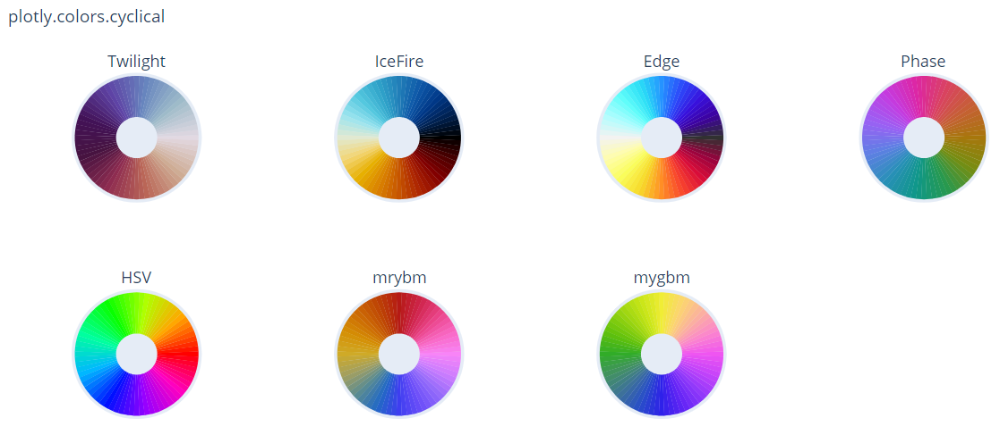
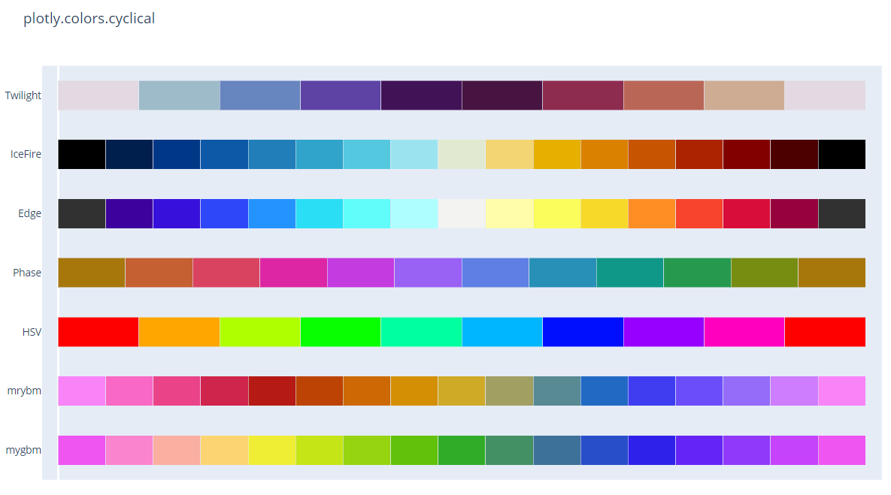

# Built-in Continuous Color Scales

- [Built-in Continuous Color Scales](#built-in-continuous-color-scales)
  - [简介](#简介)
  - [内置命名 Continuous 色阶](#内置命名-continuous-色阶)
  - [内置 Sequential 色阶](#内置-sequential-色阶)
  - [内置 Diverging 色阶](#内置-diverging-色阶)
  - [内置 Cyclical 色阶](#内置-cyclical-色阶)

2020-04-29, 14:59
*** *

## 简介

Express 函数的 `color_continuous_scale` 参数和 trace 的 `colorscale` 参数用于设置色阶。

Plotly 包含大量内置色阶，可以通过两种方式设置色阶：

- 通过色阶名称（不区分大小写），例如 `px.scatter(continuous_color_scale="Viridis")`。
- 通过色阶对象使用，如 `go.Scatter(marker_colorscale=plotly.colors.sequential.Viridis)`。

在色阶后添加后缀 `_r` 获得反转色阶，如 `Viridis_r` 或 `plotly.colors.sequential.Viridis_r`。

`plotly.colours` 模块在 `plotly.express.colors` 中也能使用，所以可以直接通过 `px.colors` 引用。

## 内置命名 Continuous 色阶

可以使用下面任意色阶名称作为 `continuous_color_scale` 或 `colorscale` 参数设置色阶。名称不区分大小写，而且添加 `_r` 后缀还能获得反转色阶。

```py
import plotly.express as px
from textwrap import wrap

named_colorscales = px.colors.named_colorscales()
print("\n".join(wrap("".join('{:<12}'.format(c) for c in named_colorscales), 96)))
```

```text
aggrnyl     agsunset    blackbody   bluered     blues       blugrn      bluyl       brwnyl
bugn        bupu        burg        burgyl      cividis     darkmint    electric    emrld
gnbu        greens      greys       hot         inferno     jet         magenta     magma
mint        orrd        oranges     oryel       peach       pinkyl      plasma      plotly3
pubu        pubugn      purd        purp        purples     purpor      rainbow     rdbu
rdpu        redor       reds        sunset      sunsetdark  teal        tealgrn     viridis
ylgn        ylgnbu      ylorbr      ylorrd      algae       amp         deep        dense
gray        haline      ice         matter      solar       speed       tempo       thermal
turbid      armyrose    brbg        earth       fall        geyser      prgn        piyg
picnic      portland    puor        rdgy        rdylbu      rdylgn      spectral    tealrose
temps       tropic      balance     curl        delta       edge        hsv         icefire
phase       twilight    mrybm       mygbm
```

内置色阶以 CSS 颜色列表的形式保存，如下所示：

```py
import plotly.express as px

print(px.colors.sequential.Plasma)
```

```text
['#0d0887', '#46039f', '#7201a8', '#9c179e', '#bd3786', '#d8576b', '#ed7953', '#fb9f3a', '#fdca26', '#f0f921']
```

## 内置 Sequential 色阶

`plotly.colors.sequential` 模块包含预定义的 sequential 色阶集合。Sequential 色阶适合于连续数据，显示量值变化。

下面是 `plotly.colors.sequential` 模块中所有的内置色阶：

```py
import plotly.express as px

fig = px.colors.sequential.swatches()
fig.show()
```


> `RdBu` 是 diverging 色阶，错误的放在了 sequential中，基于兼容考虑没有移除。

## 内置 Diverging 色阶

Diverging 色阶保存在 `plotly.colors.diverging` 模块中。Diverging 色阶适合于包含一个临界值的连续数据，如数据均值、零值等。

下面是 `plotly.colors.diverging` 模块中的色阶：

```py
import plotly.express as px

fig = px.colors.diverging.swatches().update_layout(margin_b=10)
fig.show()
```


## 内置 Cyclical 色阶

`plotly.colors.cyclical` 中包含内置的Cyclical 色阶。Cyclical 色阶适合于具有周期性结构的连续数据，如温度变化（hour of day, day of week, day of year, seasons）、角度数据等。

下面是 `plotly.colors.cyclical` 模块中所有的内置色阶：

```py
import plotly.express as px

fig = px.colors.cyclical.swatches_cyclical()
fig.show()

fig = px.colors.cyclical.swatches()
fig.show()
```




