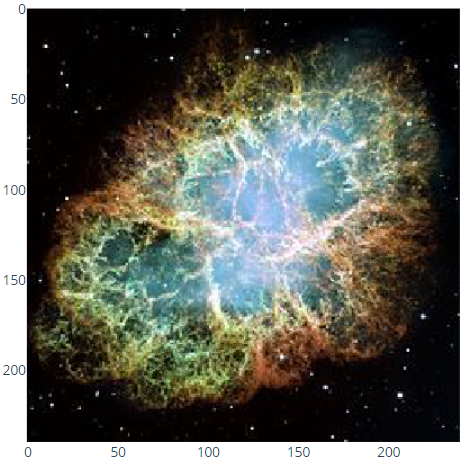
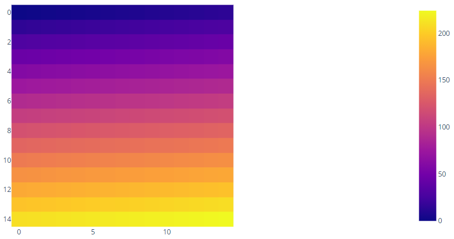
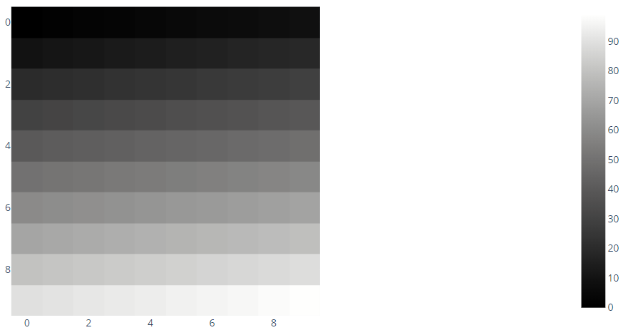

# Imshow

- [Imshow](#imshow)
  - [`px.imshow` 显示 RGB 图片数据](#pximshow-%e6%98%be%e7%a4%ba-rgb-%e5%9b%be%e7%89%87%e6%95%b0%e6%8d%ae)
  - [从图片文件读取数据数组](#%e4%bb%8e%e5%9b%be%e7%89%87%e6%96%87%e4%bb%b6%e8%af%bb%e5%8f%96%e6%95%b0%e6%8d%ae%e6%95%b0%e7%bb%84)
  - [以热图形式显示单通道2D数据](#%e4%bb%a5%e7%83%ad%e5%9b%be%e5%bd%a2%e5%bc%8f%e6%98%be%e7%a4%ba%e5%8d%95%e9%80%9a%e9%81%932d%e6%95%b0%e6%8d%ae)
  - [colorscale 选择](#colorscale-%e9%80%89%e6%8b%a9)

2020-04-30, 19:53
***

## `px.imshow` 显示 RGB 图片数据

`px.imshow` 可以显示多通道（RGB）和单通道（grayscale）图像数据。

```py
import plotly.express as px
import numpy as np
img_rgb = np.array([[[255, 0, 0], [0, 255, 0], [0, 0, 255]],
                    [[0, 255, 0], [0, 0, 255], [255, 0, 0]]
                   ], dtype=np.uint8)
fig = px.imshow(img_rgb)
fig.show()
```


## 从图片文件读取数据数组

为了获得 `px.imshow` 所需的数组，可以使用第三方库，如 PIL, scikit-image 或 opencv。下面我们演示使用 `skimage.io.imread` 读取图片：

```py
import plotly.express as px
from skimage import io
img = io.imread('https://upload.wikimedia.org/wikipedia/commons/thumb/0/00/Crab_Nebula.jpg/240px-Crab_Nebula.jpg')
fig = px.imshow(img)
fig.show()
```



使用 `skimage.data` 的示例数据：

```py
import plotly.express as px
from skimage import data
img = data.astronaut()
fig = px.imshow(img)
fig.show()
```


## 以热图形式显示单通道2D数据

对 2D 图片，`px.show` 使用 colorscale 将标量数据映射到颜色。而默认的 colorscale 取决于当前模板：

```py
import plotly.express as px
import numpy as np
img = np.arange(15**2).reshape((15, 15))
fig = px.imshow(img)
fig.show()
```



## colorscale 选择

```py
import plotly.express as px
import numpy as np
img = np.arange(100).reshape((10, 10))
fig = px.imshow(img, color_continuous_scale='Viridis')
fig.show()
```


通过选择色阶，可以将图片转换为灰度图片：

```py
import plotly.express as px
import numpy as np
img = np.arange(100).reshape((10, 10))
fig = px.imshow(img, color_continuous_scale='gray')
fig.show()
```



#