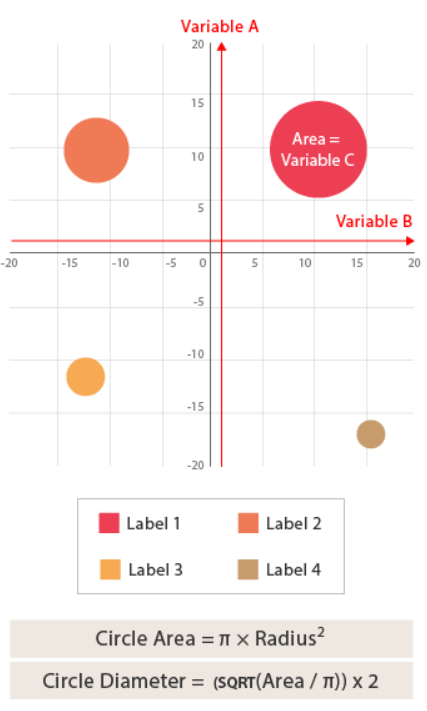

# Bubble Chart

- [Bubble Chart](#bubble-chart)
  - [简介](#%e7%ae%80%e4%bb%8b)
  - [工具](#%e5%b7%a5%e5%85%b7)

2020-05-15, 13:51
***

## 简介

气泡图（Bubble Chart）是一个多变量图，由[散点图](scatter_plot.md)和[比例面积图](proportional_area.md)组合而成。其结构如下所示：

和散点图一样，气泡图使用笛卡尔坐标系绘制所有的数据点，和散点图不同的是，气泡图每个点有一个标签或分类（在数据点旁边或 legend 上显示，如以颜色表示）。然后每个点的大小（面积）表示第三个变量。

气泡图通常用来对比不同分类之间的关系。整体可以用于分析和发现模式和相关性。

气泡过多会使得图难以阅读，因此气泡图的容纳的气泡数量大小有限。

和[比例面积图](proportional_area.md)一样，气泡的大小是基于面积，而不是直径。

## 工具

- [matplotlib](https://python-graph-gallery.com/bubble-plot/)
